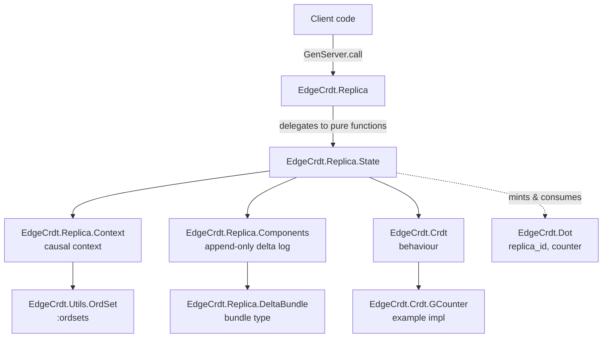
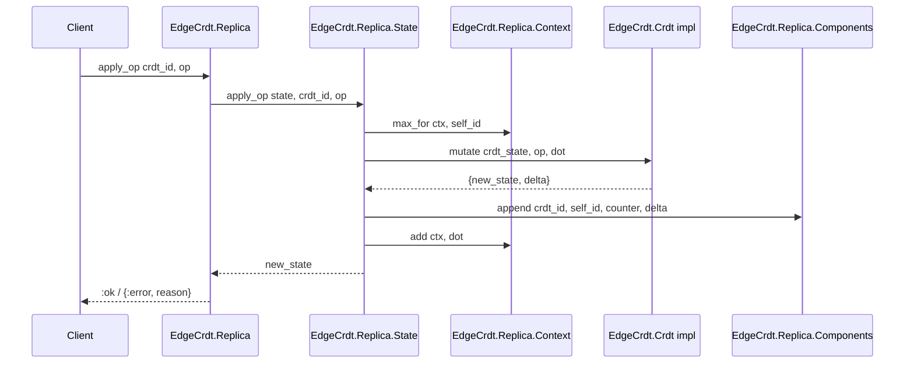

# Architecture

This project currently consists of a single in-memory **replica process** (`EdgeCrdt.Replica`) that hosts multiple CRDT instances, tracks causal history via dots, and retains an append-only per-CRDT delta/component log.

## High-level structure

## Core runtime modules

- `lib/edge_crdt/replica.ex`: GenServer facade exposing the public API (`add_crdt/4`, `ensure_crdt/4`, `apply_op/3`, `apply_remote/4`, etc.) and delegating all logic to `EdgeCrdt.Replica.State`.
- `lib/edge_crdt/replica/state.ex`: Pure, immutable state transitions. Owns the data model and implements the semantics of local and remote updates.
- `lib/edge_crdt/replica/context.ex`: Replica-wide causal context as a set of dots (per replica-id counters). Used for deduplication and for minting the next local dot.
- `lib/edge_crdt/replica/components.ex`: Append-only log of deltas (components) indexed by CRDT id → origin replica id → counter.
- `lib/edge_crdt/crdt.ex`: Behaviour contract that all CRDT implementations must satisfy (`zero/0`, `mutate/3`, `apply_delta/3`, `value/1`, etc.).
- `lib/edge_crdt/crdt/gcounter.ex`: Example CRDT implementation (grow-only counter) that produces deltas on mutation and merges incoming deltas.

## Data model (as used by `EdgeCrdt.Replica.State`)

- **Replica id**: `binary()` identifying a replica (`EdgeCrdt.Replica.id/0`).
- **Dot**: `{replica_id, counter}` (`EdgeCrdt.Dot.t/0`) identifying a single event from a replica.
- **Replica state**: `%EdgeCrdt.Replica.State{}` with:
  - `crdts`: `%{crdt_id => {crdt_module, crdt_state, meta}}`
  - `ctx`: `%EdgeCrdt.Replica.Context{}` (dots observed so far)
  - `components`: `%EdgeCrdt.Replica.Components{}` (per-CRDT delta log)
  - `policy`: map of policy flags (stored, not yet enforced in this codebase)

## Update flows

### Local mutation (`apply_op/3`)

`EdgeCrdt.Replica.State.apply_op/3`:

1. Mints a fresh dot `{self_id, max_counter_in_ctx(self_id) + 1}`.
2. Delegates to the CRDT implementation via `EdgeCrdt.Crdt.mutate/4` to compute `{new_state, delta}`.
3. Persists:
   - the updated CRDT state under `crdts[crdt_id]`
   - the delta into `components` under `{crdt_id, self_id, counter}`
   - the new dot into the replica-wide context `ctx`

### Remote delta incorporation (`apply_remote/4`)

`EdgeCrdt.Replica.State.apply_remote/4`:

1. Checks `ctx` to deduplicate: if the dot is already present, this is a no-op.
2. Delegates to the CRDT implementation via `EdgeCrdt.Crdt.apply_delta/4` (passing the current replica context).
3. Persists:
   - the updated CRDT state
   - the remote delta into `components` under `{crdt_id, origin_replica_id, counter}`
   - the dot into `ctx`

## Replication building blocks (present, but not yet wired into a protocol)

- `EdgeCrdt.Replica.Components.since/4` can generate a `DeltaBundle` for a CRDT/origin since a counter, which is a basic primitive for incremental catch-up.
- `EdgeCrdt.Replica.Digest` exists as a type alias for a per-CRDT dot summary, but is not yet produced/consumed by the runtime in this repository snapshot.
